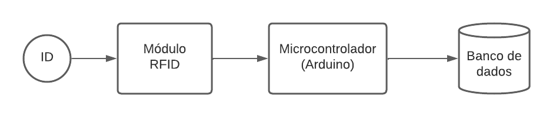
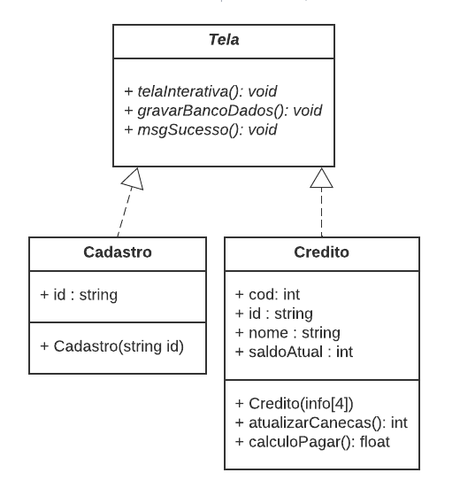

# Autosserviço de bebidas - Caixa

Protótipo de um sistema de autosserviço de bebidas, baseado em crédito para o usuário, com tag de identificação. Integrado com um sistema de gestão para o proprietário.

O fluxo de funcionamento consiste em o cliente cadastra-se no caixa a sua tag ID, e a partir desse cadastro realizar a compra dos créditos. O cliente ficaria em posse dessa tag, e poderá se servir de forma autônoma em um dos dispensers, desde que possua os créditos. Dessa forma, o equipamento proporcionará agilidade para o cliente e automação para o negócio. 

O Sistema de dispenser por meio de um módulo RFID, realizará uma consulta ao banco de dados, que por sua vez, retorna o nome do usuário, e seu respectivo crédito no display, e no caso do usuário não possuir créditos, impedir o fornecimento da bebida. O sensor de fluxo identifica a quantidade de líquido consumida em ml, e em quanto atingir o limite estabelecido interrompe o fornecimento e atualiza o crédito do usuário.

O sofware de gestão do proprietário, tem o objetivo de entregar um balancete do estabelecimento, para facilitar a gestão e controle do estabelecimento, por meio de uma aplicação web, assim permitindo que o gestor acessar remotamente. O sistema apresenta quatro áreas de informações, sendo elas: Balanço geral do estabelecimento; Vandas realizadas no caixa; Consumo dos usuários no dispenser; e o registro das despesas do estabelecimento. 

Esse repositório destina-se ao *caixa* do protótipo, o projeto deve ser executado junto com os seguintes repositórios: 
- Banco de dados: https://github.com/guilhermesetim/selfservice-bebidas-bd
- Dispenser: https://github.com/guilhermesetim/selfservice-bebidas-dispenser
- Software de gestão: https://github.com/guilhermesetim/selfservice-bebidas-gestao

## Arquitetura do Caixa

Semelhante ao dispenser, a entrada do sistema consiste na leitura da tag do usuário por meio do módulo RFID, o módulo RFID comunica com o microcontrolador para enviar o código ID da tag. O microcontrolador realiza o tratamento das informações de byte para hexadecimal, e envia ao servidor o código via porta serial. Entretanto, o cadastramento e a adição de crédito acontecem via software. O embarcado nesse sistema serve apenas para identificação automática do usuário no sistema.



### Hardware utilizado
- Arduino Uno;
- Cabo USB-B;
- RFID MFRC-522;


### Software
#### Microcontrolador
- Linguagem de programação: C/C++;
- Bibliotecas:
  - SPI: comunicação entre o microcontrolador e um ou mais periféricos.
  - MFRC522: Módulo MFRC522.
 
#### Servidor
- Linguagem de programação: Python
- Bibliotecas:
  - PySerial: transmissão e recebimento dos dados Arduino/Computador via porta Serial;
  - MySql Connector/Python: drive de comunicação Python com banco de dados MySql;
  - PySimpleGUI: Biblioteca de interface gráfica para Python; 

##### Diagram de Classes


## Como executar o projeto

O módulo RFID utiliza obrigatoriamente portas especifícas (RST - 9; SDA - 10; MOSI - 11; MISO - 12; SCK - 13).

O microcontrolador deve ser carregado por meio do Arduino IDE, com o arquivo caixa_arduino.ino. Juntamente instalar as bibliotecas:
- MFRC522: instalada por meio da Arduino IDE, ou pelo repositório do GitHub: https://github.com/miguelbalboa/rfid


O servidor ser executado com o python, o arquivo main.py. Juntamente com a instalação das biliotecas:
```
pip install pyserial
pip install PySimpleGUI
pip install mysql-connector-python
```

### Como adequar ao seu projeto
No servidor é necessário execuar o banco de dados MySQL, e informar o endereço e senha do banco de dados utilizado. Além de informar a porta USB que o microcontrolador está executando, para Windows utiliza-se 'COM' e para sistemas UNIX  '/dev/ttyUSB', ambos seguidos do número da porta.

# Autor
Guilherme Setim